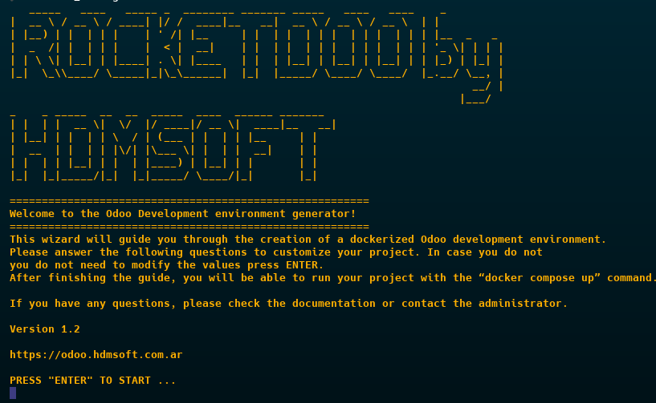

# Launching ROCKETDOO

Now we start ***ROCKETDOO*** by running its launcher with the command:

~~~
rocketdoo
~~~

This will open its interactive CLI screen; it will welcome us and after pressing ***ENTER*** it will start asking for information to create our environment.

## What does Rocketdoo ask us?

This is a series of questions that the framework will ask us in order to build our development environment according to our needs.
development environment according to our needs.

* Odoo version
* Name of our project
* Postgresql version
* Name of our database container
* Master Password
* Name of the image to build
* Name of the Odoo web container
* Odoo Port
* Port of Vs Code
* If we want the containers to restart by themselves, and in what way

After this, it will ask us the following questions:

* In which Odoo edition we are going to develop, either Community “ce” or Enterprise “ee”.
* If we will use private repositories
* If we will use third party repositories
    * URL of the third party repository
    * Version of the repo
    * What we will name that repository
    * ... And then if you want to continue uploading more third party repositories or not.

We consider that it will not be necessary to go through every question that Rocketdoo will ask us, since in that process
provides us with default options, as well as suggestions.

---------------------------------------------------------------------------------------------------------------

## Tips

What is important to note are the following guidelines for use: 

1. First of all it is necessary that we know that the name of the web container “Odoo”, the name of the database container “Postgresql” and the name of our project, should not be the same or repeated
database container “Postgresql” and the name of our project, should not be the same or repeat each other if we have already created a project.
if we have already created a development project previously. Since if we repeat it in another occasion, when we are about to
we are about to raise our project, docker will give us an error informing us that those containers already exist.
If you have this case, you will have to cancel the operation with the keys ***CTRL + C*** and to execute again
Rocketdoo.

2. The same happens with the Odoo and VSCode ports; they should not be repeated in another project, in order to make it easier to have more
to be able to have more than one development environment running at the same time.
That is to say, if in our first project we assign the default port **8069** in a new project we will use a different one, e.g.: **8069**.
we will use a different one, for example: **8169**. This same case is recommended for the VSCode port.

3. Once we finish the development or the use of one of the environments, we can stop the whole project and even delete traces of it with
and even remove traces of it with the command:

~~~
docker compose stop
~~~
To stop the containers.

or this command to remove the entire contents with the volumes:

~~~
docker compose down -v
~~~

Once this action is done, now if the ports they occupied will be free to be used in new development environments.

------------------------------------------------------------------------------------------------------------------

*** If you choose to develop in Odoo Enterprise, be careful before using the launched ROCKETDOO, to put
the *Enterprise* folder in the working directory at the level of *addons*.***

-------------------------------------------------------------------------------------------------------------------

## All done!

Once we have finished the questions that Rocketdoo asks us, we will be able to definitively launch our environment 
with the command:

~~~
docker compose up
~~~

*Note that this step requires a long time between 1min and 8min depending on the amount of third party repositories we have loaded.
third party repositories that we have loaded. And this is because our framework will clone the repositories and copy that information to the
repositories and copy that information inside the web container, install all the requirements that each repository has, as well as
repository has, as well as downloading the official Odoo and Postgresql images to your machine.
Although this particular action is a one-time only action.

Once Rocketdoo has finished creating the environment and we see the Odoo log running, we will be able to login with our preferred browser, and start
Once Rocketdoo has finished creating the environment and we see the Odoo log running, we can log in with our browser of choice, and start creating our first database.

~~~
http://localhost:8069
~~~

Then you can start to install the modules you need, and you can verify that you will have at your disposal the third party modules or
third party modules or module packages that you have loaded during the launch process.
