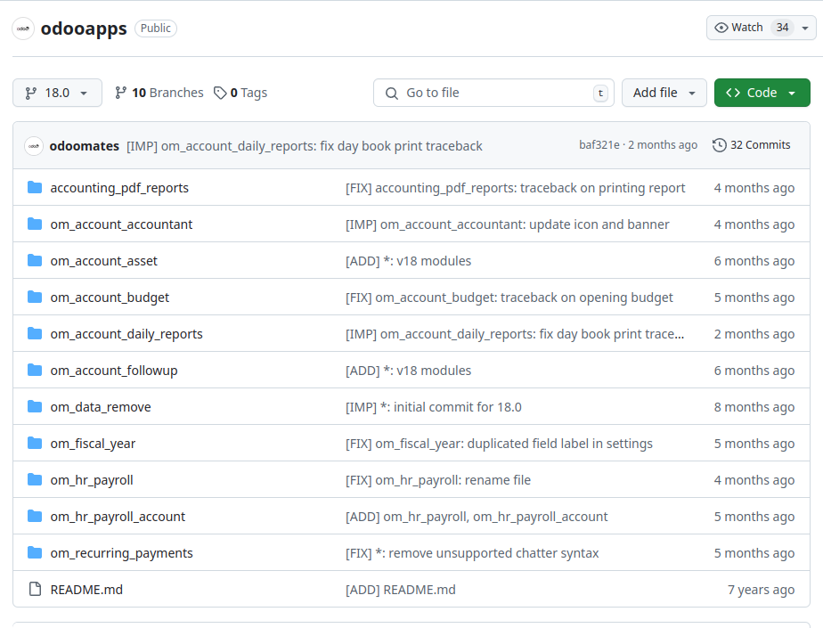
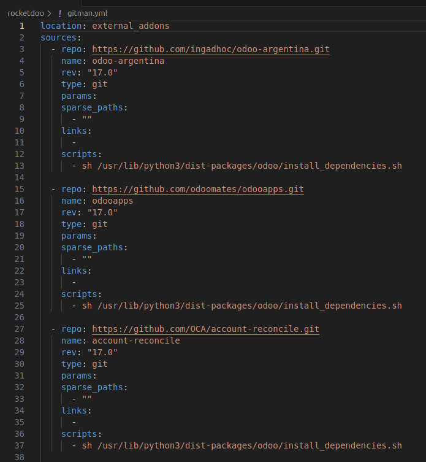

# Public Repositories

Our launcher **ROCKETDOO** provides us with the option to use private repositories, which we consider an interesting option 
that will support us as developers, facilitating the installation of directories and their
dependencies and necessary libraries in an autonomous way.

**ROCKETDOO** uses the *Gitman* tool to perform this configuration, where it will ask us for the URL of the repository and the
determine the version of the same one and determine a name to that repository or package of
or package of modules.

When we refer to occupy modules of third parties or public repositories, in fact it is a
tool designed more than anything else for those module packages, that many times are necessary, for example for the
case of packages that contain a compendium of modules that provide functions to complement, for example, accounting.

A good example of this is to mention the packages of the company *Odoo Mates*, which provide a package of modules to
to complement the accounting in Community instances.

As you can see in the image above, *odooapps* is a package that contains a lot of modules to complement the
the accounting and that between them, there are dependencies.

Otherwise, it would be only up to the developer's research, to know which modules are needed and their dependencies,
as well as to read each one of them in its content to check if they have requirements.txt.
and install them by hand; making the task long and with risks of committing some mistake.

Once we load the desired amount of public repositories, **ROCKETDOO** takes care of configuring everything and creating a *gitman.yml*
file where it will contain all the information of these repositories provided by us, during the launch of our **ROCKETDOO** deployment tool.

Next we will show a gitman file in image, so that you can understand how our launcher takes care of creating and configuring it.

In that image, we can see 3 different module packages with their corresponding Odoo version and with a descriptive name.

Also, mention that inside our Odoo container, these packages will be hosted in the folder
**external_addons** in the path *usr/lib/python3/dis-packages/odoo/external_addons*.

This file is self-generated as we provide this information to **ROCKETDOO** during the launch.

In short, and to conclude why using *Gitman* has to do with the use of packages of modules rather than the use of
individual and independent modules, since a single module is much more viable to download it and clone it in the **addons** folder.