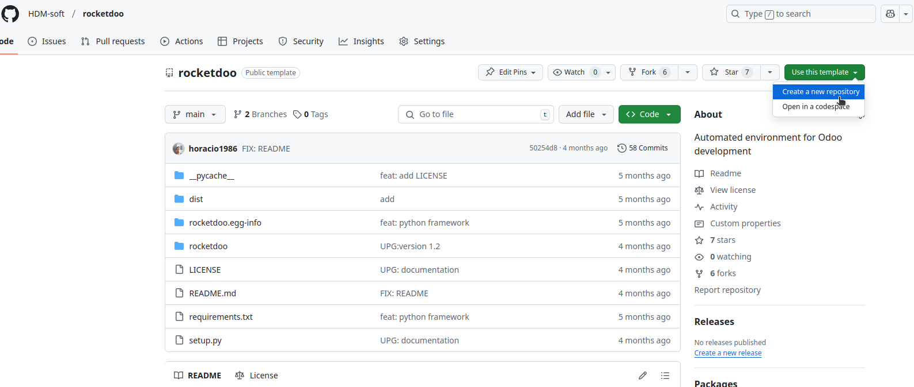
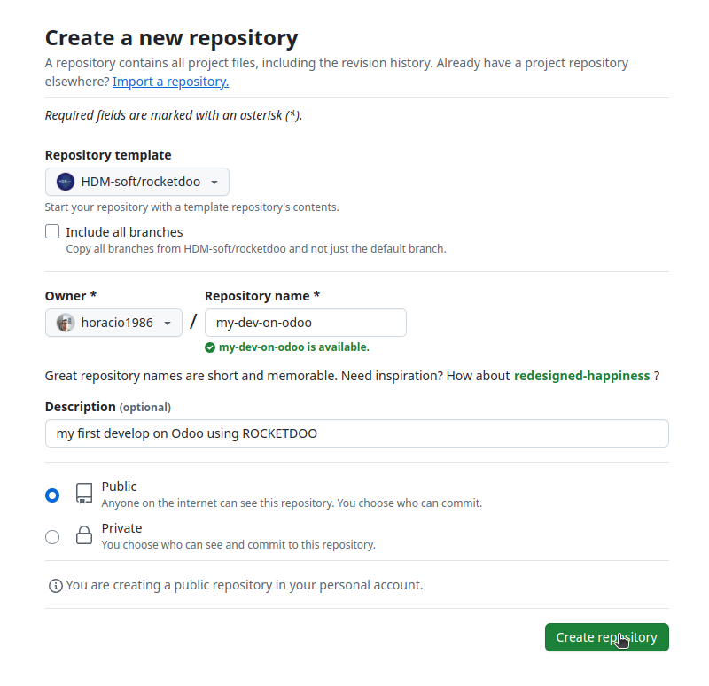
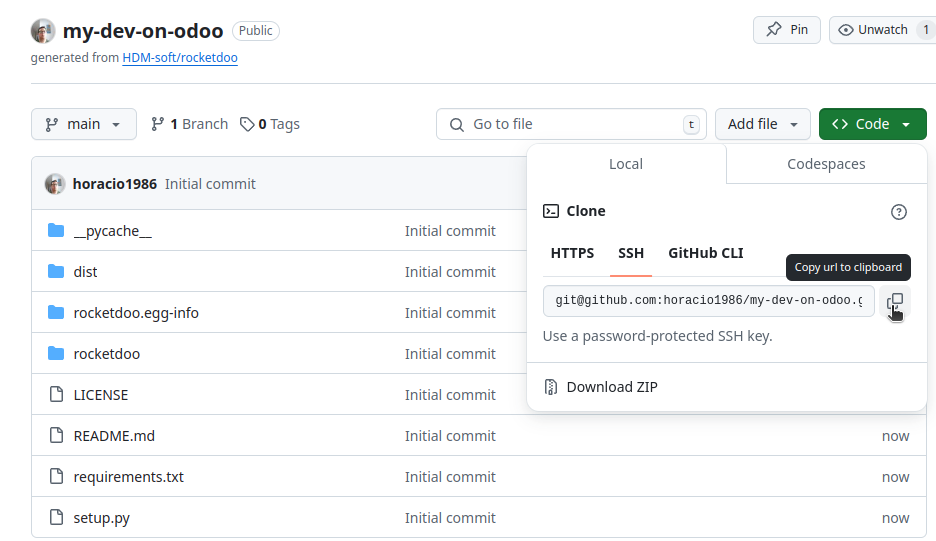
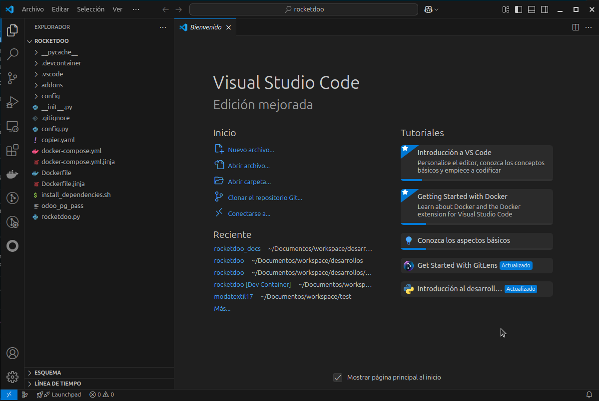

## Step by Step

### Step 1:

The first thing we must do is go to the **ROCKETDOO** repository [here](https://github.com/HDM-soft/rocketdoo)

It is imperative to understand that this repository is built as a **Template**, therefore it must be used as a template and should NOT be directly cloned or forked.

### Step 2:

Use the template to create your own development repository by clicking the *use this template* button and then *create new repository*.
This will take you to your own GitHub account so you can begin creating your development repository.

### Step 3:

In your account, you should name your development project and, if desired, add a description.
However, it's important that you don't select *include all branches*, as you only need the *main* branch to develop. Once ready, you decide whether the development will be private or public and click the *create repository* button.

### Step 4:

Once the repository is created, you can clone it by copying the *URL* or *SSH* link

### Step 5:

Enter the repository created and cloned from our **ROCKETDOO** template using the command:

~~~
cd my-dev-on-odoo
~~~
Once inside the repository, we list all the files with the command: 

~~~
ls
~~~

### Step 6:

In this step, we should have **ROCKETDOO** (i.e., the library) installed. If you don't, you can do so with the command:

~~~
sudo pip install rocketdoo
~~~

After making sure you have **ROCKETDOO** installed correctly ***(If the terminal generates an error when you try to install ROCKETDOO or another library, we will see how to solve it in the "Common Mistakes" section)***

### Step 7:

Install the requirements from the ***requirements.txt*** document

~~~
sudo pip install -r requirements.txt
~~~

### Step 8:

Now you should enter the **rocketdoo** subdirectory, meaning you'll be located at ***my-dev-on-odoo/rocketdoo***

~~~
cd rocketdoo
~~~

### Step 9:

In this step, you can open Visual Studio Code with the command:

~~~
code .
~~~

And this will open you up in your work area, that is, development.

-------------------------------------------------------------------------------------------------------------------------------------------

BUT DON'T GET TOGETHER!! WE WON'T WORK ON VS CODE YET! On the next page, we'll start with the ***ROCKETDOO*** launcher. >>>>