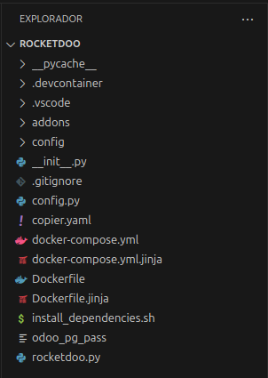
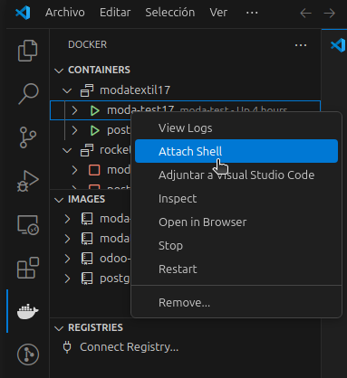

# Rocketdoo Structure

In this section we will see with a little more clarity how Rocketdoo's structure is conformed, and in this way we will be able to give clarity
on how it works from the back, or at least to understand the importance and the use of some folders and files of Rocketdoo.

As you can see in the image there is a long list of folders and files that comprise the entire Rocketdoo structure.
However, we will detail the folders and files of importance for a developer.

These folders and files are of knowledge or should be of knowledge for any Odoo developer.

----------------------------------------------------------------------------------------------------------

## /Addons

First, we will mention the **addons** folder.

Once our environment is ready and inside Visual Studio Code, or from the terminal, as you prefer to handle it,
you will use this folder to host the developments that you are about to make. As well as maybe some modules
necessary for you (individual modules).

For this, you can use to create a folder with the name of your module to be developed and the necessary content of it,
or by using the VSCode extension **Docker** you can open a terminal with the option
*attach shell* and move to the directory where the modules are located */usr/lib/python/dist-packages/odoo/extra-addons*
and use Odoo's **scaffold** command to create a new module.

***It is important to note that the “addons” folder inside our development container is mapped and created as volume
in the “extra-addons” folder, this is why we must go to that folder inside the container. Since as you know
the folder named addons belongs to the Odoo core, and this we will see more clearly when we enter the container
to debug code.***

To create a new module with the “scaffold” command you must use it as follows:
~~~ 
odoo scaffold <my_module> .
~~~

This will create a module with the content and files needed to start developing in the directory where we are standing.

After creating it, we can also see in VSCode that the same module is now present in our working directory, inside the **addons** folder.

***Remember that the “addons” folder in our working directory, inside Odoo and the container is called “extra-addons ”***.

## /Config/odoo.conf

This directory and file in question **odoo.conf** is a knowledge file especially for experienced Odoo developers.

In this file is stored the complete configuration of the system at the server level.
In this file the mapping of third party and developed modules is managed, as well as the configuration of the Master Password,
the path to the log file, etc.

But do not worry that it is a file that will not be necessary to modify a priori, because during the launch of
**This file is self-configured with the framework.

## Enterprise

As we have seen, when we launch **ROCKETDOO**, almost at the end it asks us if we want to develop in Odoo
Community or Enterprise.

OK! if our answer is *"ce ”* we will not need to do anything extra.
Now, if our answer is *"ee ”*, that is to say Enterprise, in fact it is important that before launching

Rocketdoo, we have the folder *Enterprise* in our working directory at the same level as *addons*,
because in this way the system will be able to map the folder with the modules belonging to **Enterprise** and also perform the necessary
configuration in the environment to be able to run this edition of Odoo.